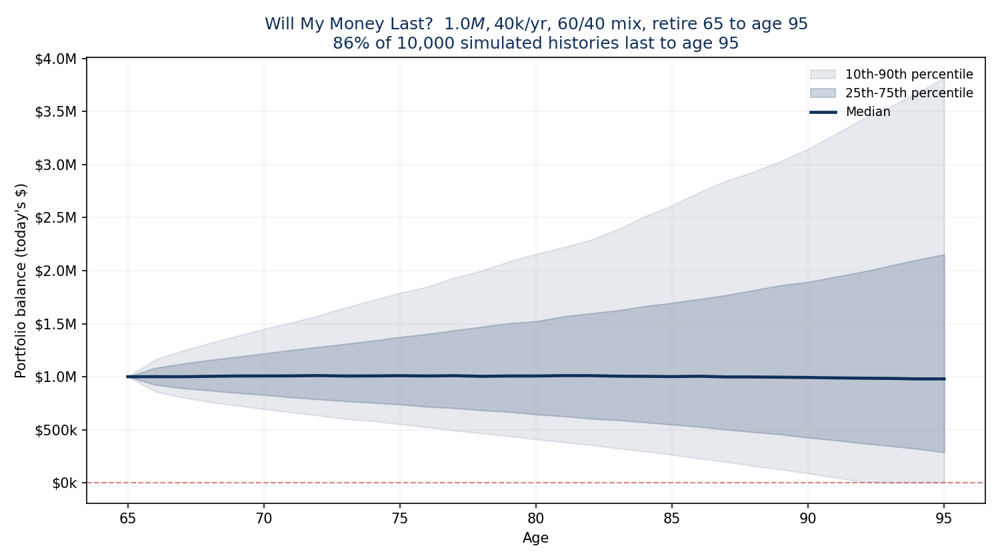

# Will My Money Last?

A retirement income Monte Carlo simulator. Enter someone's savings, spending, retirement age, and stock/bond mix, and it returns the probability their money lasts, tested across 10,000 simulated market histories.

**Live demo:** https://leomgama.github.io/retirement-income-simulator/



## The question

Retirement clients ask one thing before anything else: will my money last? Because the order of yearly returns changes the outcome, this tool runs 10,000 market histories and reports how often the money lasts, with the full range of balances behind it.

## What it does

You enter four numbers and a mix. It runs 10,000 market scenarios and returns:

- the probability the money lasts to a target age,
- a fan chart of the balance over time (10th to 90th and 25th to 75th percentile bands, plus the median),
- the median money left at the end, and
- the age the money typically runs out when a plan falls short.

## How it works

Everything is in real (inflation-adjusted) dollars, so spending stays flat in today's money and inflation is not a separate variable. Each year a path withdraws the spending first, then grows what is left by a random real return drawn for that year. Yearly returns are lognormal, so a return can never be worse than -100%. A path fails the first year it cannot fund a full withdrawal. Running this 10,000 times, including the unlucky paths where weak markets land early in retirement, is how sequence-of-returns risk shows up in the result.

Return assumptions are sourced, not invented:

| Asset | Real return (annual) | Volatility |
| --- | --- | --- |
| Stocks | 7% | 20% |
| Bonds | 2% | 6% |

Long-run US history (SBBI/Ibbotson 1926 to 2024, cross-checked against Damodaran). Stocks at 7% is a touch below the historical arithmetic average on purpose, so the tool does not overstate the odds. Stocks and bonds are assumed uncorrelated, which is a simplification (see Limitations). All assumptions are visible in the tool and adjustable in the code.

## What it shows

Four sample profiles, run at the default seed:

| Profile | Savings | Spending | Mix | Retire → plan to | Withdrawal | Success | Median left |
| --- | --- | --- | --- | --- | --- | --- | --- |
| Comfortable | $1.20M | $45k | 60/40 | 65 → 95 | 3.8% | 90% | $1.36M |
| Baseline 4% | $1.00M | $40k | 60/40 | 65 → 95 | 4.0% | 86% | $0.98M |
| Conservative | $0.90M | $38k | 50/50 | 67 → 92 | 4.2% | 93% | $0.72M |
| Tight | $0.70M | $45k | 55/45 | 64 → 95 | 6.4% | 27% | $0 |

How much you spend relative to savings is the biggest lever, with the time horizon and the stock/bond mix close behind. The Baseline 4% case lands at 86%, in range with published research on the 4% rule (Bengen's historical work near 95%, Morningstar's 2026 work near 90% for a 30-year plan). The Tight case shows what a 6.4% withdrawal does: the money runs out before the target age in nearly three of four scenarios.

## Validation

The engine ships with a test suite (`python -m pytest`, 7 tests):

- **Zero-volatility check.** With volatility off, the simulated path matches the closed-form annuity formula exactly (to 9 decimal places). This proves the arithmetic, not just the plausibility.
- **Monotonicity.** Success falls when spending rises, climbs when savings rise, and falls over a longer horizon.
- **Reproducibility.** The same seed returns the same answer.
- **Convergence.** The probability is stable as the number of runs grows.
- **4% anchor.** The classic case lands in the published band.

The Python engine and the browser version (`index.html`) use the same formulas and agree to simulation tolerance.

## Limitations

- Yearly returns are independent and identically distributed. Real markets have fat tails and some autocorrelation, which this does not model.
- Spending is constant in real terms. It does not model spending that changes with age, one-off costs, or guardrail strategies.
- No Social Security, pensions, taxes, or fees. These matter in a real plan.
- Stocks and bonds are assumed uncorrelated.
- Long-run assumptions are not a forecast. Any 30-year stretch can fall outside them.

This is a teaching and demonstration tool, not a financial plan.

## Compliance note

This is a personal prototype that uses hypothetical illustrations and carries a clear "not financial advice" disclaimer. Putting a tool like this on a regulated advisory firm's website (such firms operate under FINRA/SEC oversight) would require that firm's own compliance review of the assumptions, disclosures, and any lead capture.

## Run it locally

```bash
pip install -r requirements.txt
python retirement_sim.py      # prints the 4% anchor result
python -m pytest -v           # runs the 7 validation tests
```

Open `index.html` in any browser for the interactive version. No build step or server needed.

## Built with

Python, NumPy, pytest, JavaScript, Chart.js.

## Credit

Built by [Leonardo Gama](https://leomgama.github.io). Data analyst, southern Ohio.
